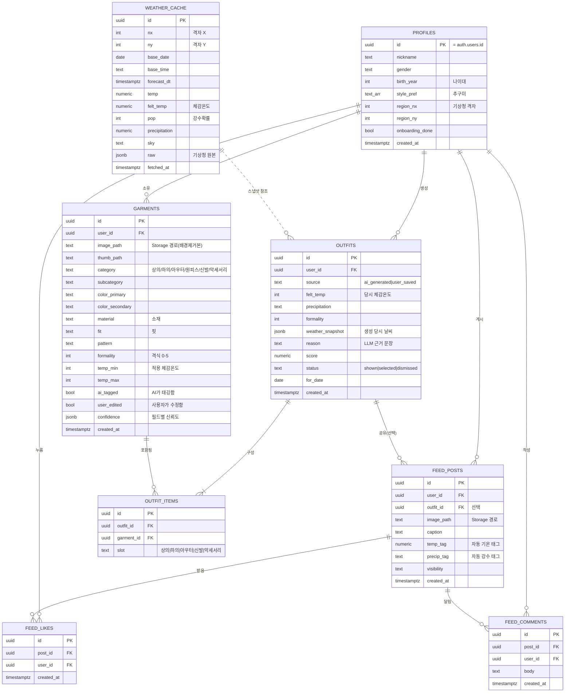

> ⚠️ **구버전 — 옷 조합형(2026-07-09 피벗 이전).** 이 문서는 "내 옷을 태깅해 조합" 모델 기준이라 코어 메커니즘·배경제거·소셜/3탭·데이터 스키마 부분은 **현행과 충돌(무효)**. 현행 정답 = `CLAUDE.md` · `서비스 아키텍처/데이터모델_v2_분위기매칭형.md` · `문서_정본지도_v1.md`. (문제정의·리서치 등 모델중립 내용은 참고 가능)

---

# rainism 데이터 모델 설계서 v1

> 검증 단계 기준 · 2026-07-09
> 저장 스택: **Supabase** — Postgres(구조화 데이터) · Storage(이미지) · Auth(계정) · RLS(권한)

## 큰 그림 — 데이터는 5개 영역

| 영역 | 무엇 | 핵심 테이블 |
|---|---|---|
| 👤 **사용자** | 누가 쓰는가 | `profiles` |
| 👕 **옷장(코어)** | 내 옷과 코디 | `garments` · `outfits` · `outfit_items` |
| 🌧️ **날씨** | 오늘의 숫자 | `weather_cache` |
| 💬 **소셜** | OOTD 피드 | `feed_posts` · `feed_likes` · `feed_comments` |
| 📚 **참조·설정** | 앱이 공유하는 규칙 | `coordi_rules` · `taxonomy` |

**세 가지 저장 형태를 구분해서 씁니다:**
- **Postgres 행/열** — 구조화된 관계형 데이터 (옷 속성, 코디, 좋아요 등) 대부분
- **Supabase Storage(파일)** — 이미지 원본. DB엔 파일 경로(`image_path`)만 저장
- **jsonb 열** — 형태가 유동적인 것 (날씨 원본, AI 태깅 신뢰도, 코디 당시 날씨 스냅샷)
- **Auth(auth.users)** — 이메일·비밀번호 등 계정 자격은 Supabase가 관리, 우리는 `profiles`로 1:1 연결만

---

## 관계도 (ERD)

> 참조 데이터(`coordi_rules`, `taxonomy`)는 사용자별이 아니라 앱 전역이 공유하므로 ERD 관계선에서 뺐습니다(아래 별도 설명).

---

## 데이터 생애주기 — 어디서 생기고, 어떻게 저장되고, 무엇과 연결되나

| 데이터 | 어디서 생성 | 저장 형태 | 연결 |
|---|---|---|---|
| **profiles** | 가입(Auth) + 온보딩 폼 | Postgres 행 | `auth.users`와 1:1 · 모든 개인 데이터의 뿌리 |
| **garments** | ①사진 촬영 → ②폰에서 배경제거(@imgly) → ③Storage 업로드 → ④`/api/tag` 비전 LLM → ⑤사용자 수정 | 이미지=Storage 파일, 속성=Postgres 행, 신뢰도=jsonb | `profiles`(소유) · `outfit_items`로 코디에 포함 |
| **outfits** | `/api/coordi` 엔진 결과(3코디) 또는 사용자 저장 | Postgres 행 + `weather_snapshot` jsonb | `profiles`(생성) · `outfit_items`로 옷과 M:N · `weather_cache` 스냅샷 |
| **outfit_items** | 코디 조합 시 엔진이 생성 | Postgres 행(연결 테이블) | `outfits` ↔ `garments`를 M:N으로 잇는 다리 |
| **weather_cache** | `/api/weather`가 기상청 호출·파싱, **서버가 쓰기**(service role) | Postgres 행 + `raw` jsonb | 격자(nx,ny)로 `profiles.region` 매칭 · `outfits`에 스냅샷 |
| **feed_posts** | 사용자 게시. 그날 날씨로 기온·강수 **자동 태깅** | 이미지=Storage, 글=Postgres 행 | `profiles`(게시) · `outfits`(선택 연결) · 좋아요·댓글의 부모 |
| **feed_likes / comments** | 피드에서 사용자 상호작용 | Postgres 행 | `feed_posts` + `profiles` · Realtime 구독 대상 |
| **coordi_rules** | 우리 팀이 만든 규칙표 CSV(seed) | Postgres 테이블 또는 번들 파일(전역) | 엔진이 읽어 `outfits` 생성에 사용 |
| **taxonomy** | 우리 팀이 정의한 한글 카테고리·색·소재 enum | 참조 테이블/상수(전역) | `garments` 태깅의 값 목록 |

---

## 핵심 설계 결정과 이유

- **이미지는 DB가 아니라 Storage에** — 사진을 DB에 넣으면 무겁고 비쌈. DB엔 경로(`image_path`)만 두고 파일은 Storage에. 조회·전송이 빠르고 저렴.
- **코디↔옷은 M:N (연결 테이블)** — 한 옷이 여러 코디에 쓰이고, 한 코디는 여러 옷으로 구성됨. `outfit_items`가 이 다중 관계를 풀고, `slot`으로 "어느 자리(상의/하의…)"인지 기록.
- **날씨는 사용자 데이터가 아니라 캐시** — 같은 동네(격자) 사람은 같은 날씨를 공유. 유저별로 저장하지 않고 격자+시각으로 캐싱해 기상청 호출을 아끼고 앱을 빠르게. 코디엔 "그때 그 값"을 `weather_snapshot`으로 박제(나중에 날씨가 바뀌어도 코디 근거는 그대로).
- **human-in-the-loop을 데이터로 추적** — `ai_tagged` / `user_edited` / `confidence`로 "AI가 넣었나, 사람이 고쳤나"를 남김. 태깅 품질(최대 리스크 1)을 측정·개선하는 근거가 됨.
- **RLS로 "내 것만"** — 모든 개인 테이블은 `user_id = auth.uid()` 규칙(Row Level Security)으로 잠금. 앱이 Supabase에 직접 붙어도 남의 옷장은 절대 못 봄.
- **참조 데이터는 전역 공유** — 규칙표·taxonomy는 유저마다 복제하지 않고 한 벌만. 규칙을 고치면 전체에 즉시 반영.

---

## 나중에 붙을 데이터 (검증 이후, 잠정)

- **affiliate_products** — 코디의 "빈 슬롯 gap-filler" 어필리에이트 상품(라이선스 피드). 수익모델용. `outfit_items`의 빈 자리에 추천으로 연결.
- **outfit_feedback / telemetry** — 3코디 중 무엇을 골랐나 등 학습용 신호(현재는 `outfits.status`로 최소 기록).
- **notifications** — 웹푸시 토큰·발송 이력(습관화 단계).
