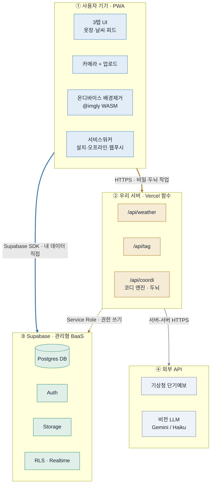
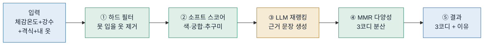
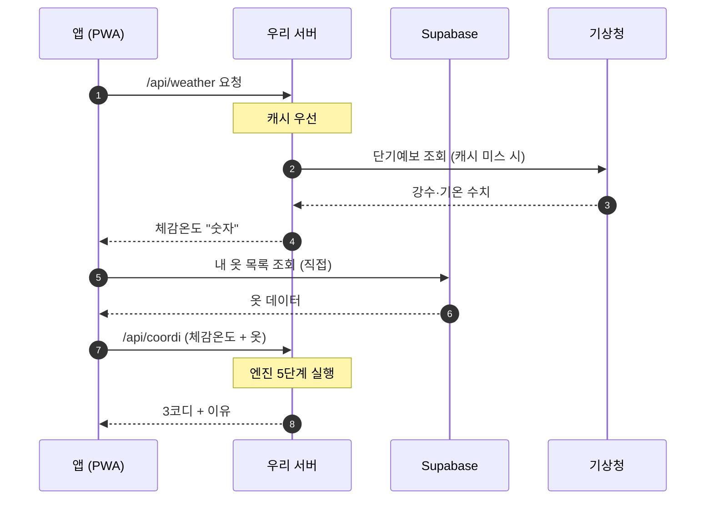
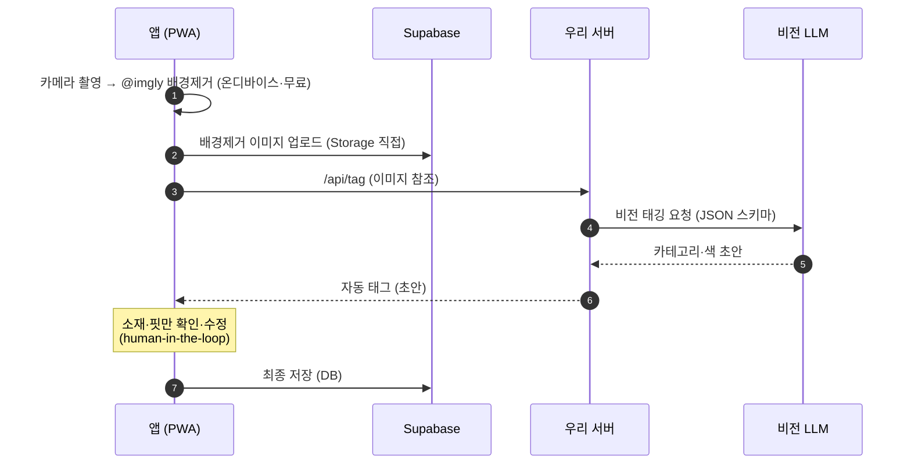
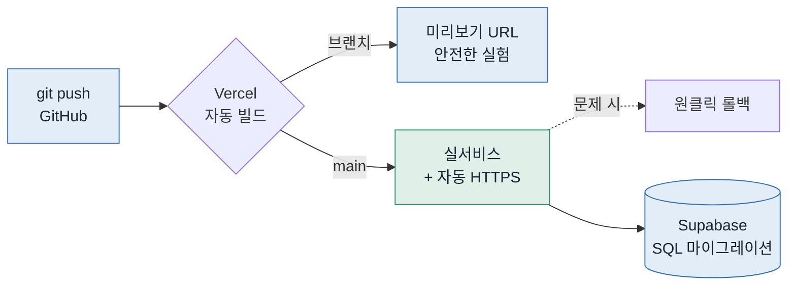

> ⚠️ **구버전 — 옷 조합형(2026-07-09 피벗 이전).** 이 문서는 "내 옷을 태깅해 조합" 모델 기준이라 코어 메커니즘·배경제거·소셜/3탭·데이터 스키마 부분은 **현행과 충돌(무효)**. 현행 정답 = `CLAUDE.md` · `서비스 아키텍처/데이터모델_v2_분위기매칭형.md` · `문서_정본지도_v1.md`. (문제정의·리서치 등 모델중립 내용은 참고 가능)

---

# rainism 전체 아키텍처 설계서 v1

> 검증 단계 기준 · 2026-07-09
> 스택 전제(안 A): **Next.js(PWA) · Vercel · Supabase · 비전 LLM(Gemini/Haiku) · 기상청 공공 API · @imgly 온디바이스 배경제거**

## 설계 사상 한 줄

> **"데이터는 Supabase가, 비밀·두뇌는 우리 서버가, 화면은 PWA가."**
> 내 옷장을 읽고 쓰는 일은 앱이 Supabase에 **직접**, API 키가 필요하거나 머리를 써야 하는 일(날씨·태깅·코디)만 **우리 서버(Vercel 함수)를 거쳐서** 처리한다.

---

## 1. 시스템 배치 (4개 층 · 두 갈래 통신)



- **파란 선** = 내 데이터를 Supabase에 **직접** (빠름, RLS로 보호)
- **노란 선** = **우리 서버를 거쳐** (API 키 숨김·로직 실행)
- **왜?** 혼자 운영하려면 "내가 지키는 서버"를 최소화. CRUD는 Supabase가 인증·권한까지 해주니 직접 연결, 키·과금이 걸린 일만 얇은 서버 한 겹 뒤에 숨긴다.

---

## 2. 코디 엔진 파이프라인 ("랜덤 아님"의 정체)



- **초록** = 공짜 규칙 코드(품질의 80%) · **노랑** = LLM 소량 호출(말맛만)
- 이 로직은 `lib/coordi`에 순수 함수로 격리 → 나중에 네이티브로 갈 때 그대로 재사용.

---

## 3. 흐름 A — 아침 · 오늘의 3코디



---

## 4. 흐름 B — 옷 등록 (12벌의 벽 넘기)



---

## 5. 배포 흐름



---

## 6. 코드 구조 (Next.js App Router)

```text
app/                     # 화면 + 서버함수 한 몸
  (tabs)/
    closet/              # 나만의 옷장 (코어)
    weather/             # 날씨
    feed/                # 피드 (소셜, 마지막)
  api/                   # ← 비밀·두뇌 (서버에서만 실행)
    weather/route.ts
    tag/route.ts
    coordi/route.ts
lib/                     # 순수 로직 — UI와 분리, 재사용
  supabase/              # 클라이언트/서버 커넥션
  coordi/                # ★ 코디 엔진(필터·스코어·재랭킹·MMR)
  weather/               # 기상청 파서 · 격자(동네) 변환
  vision/                # 비전 LLM 태깅 래퍼
  taxonomy/              # 한글 카테고리 스키마
components/              # 공용 UI 조각
data/
  coordi-rules.csv       # 규칙표 v1 (여름·여성) 자산
public/
  manifest.json · sw.js  # PWA 설치·서비스워커
supabase/migrations/     # DB 스키마 버전 관리(SQL)
```

- **기능 콜로케이션** — 탭 단위로 화면을 모아 혼자서도 안 헷갈리게.
- **두뇌 격리** — 값나가는 로직은 전부 `lib/`의 순수 함수로. 비밀 키 쓰는 코드는 오직 `app/api` 안에만.

---

## 이 설계가 미래에 갚아주는 곳

네이티브로 갈 때(React Native), 다시 짜는 건 **`app/`의 화면뿐**이다. `lib/`의 코디 엔진·기상청 파서·태깅 로직과 Supabase 백엔드는 그대로. "PWA로 빠르게 검증 → 네이티브로 습관화" 로드맵이 이 구조 위에서 재작성 없이 이어진다.
