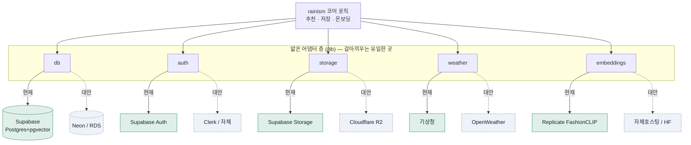

> ⚠️ **임베딩 모델 주의(현행 보정).** 이 문서의 **FashionCLIP은 잠정 후보**다 — '무드/분위기' 캡처는 **미검증**. 착수 전 바이크오프(`docs/additional_tech_review_v1.md` 스파이크①)로 확정하며 결과에 따라 embedding 정의가 바뀔 수 있다.

> 🔄 **2026-08-17 갱신:** 「참고 사진 올리기」 기능은 **폐기**됐다. 아래 본문에서 *참고사진*이 질의로 쓰인다고 적힌 부분은, 이제 **온보딩에서 유저가 고른 사진들**(PRD FR-1)로 읽으면 된다. 임베딩 + 벡터 유사도라는 방식 자체는 그대로다.

---

# rainism 의존성 리스크 완화 v1

> 2026-07-09 · [external_dependencies_v1.md](external_dependencies_v1.md)의 후속 — "과잉의존 지점 + 대안·구조적 보완"
> 원칙: 검증 단계엔 **다 이중화하지 않는다.** "문을 열어두는 값싼 보험"만 지금, 진짜 이중화는 검증 후.

## 어디가 과잉의존인가 (핵심기능 × 집중도로 랭킹)

| 순위 | 서비스 | 왜 과잉의존인가 | 위험도 |
|---|---|---|---|
| 🥇 | **Supabase** | DB·벡터검색·인증·저장·권한 **5개 핵심 기능이 한 벤더에** | 높음 |
| 🥈 | **기상청(단일 날씨 소스)** | 앱의 **트리거**가 날씨인데 무료 단일 API(한도·다운) | 중 |
| 🥉 | **FashionCLIP + 단일 추론 호스트** | 매칭의 심장(임베딩)이 한 모델·한 호스트, **교체 시 전체 재임베딩 함정** | 중 |
| 4 | **큐레이션 라이브러리 단일 라이선서** | 코어 자산 사진을 한 곳에서만 받으면 그 계약이 곧 생명줄 | 중(잠재) |
| 5 | Vercel | 호스팅 집중이나 Next.js 표준이라 이전 쉬움 | 낮음 |

---

## 1. Supabase — 가장 큰 과잉의존 🥇

**문제:** 5개 핵심 기능이 한 묶음. 다운·가격인상·이탈 시 **다섯 개가 동시에** 흔들림.

**대안:** Postgres 부분은 Neon·RDS·자체호스팅으로 이식 가능(pgvector도 표준). Auth·Storage는 재작업 필요(중간 lock-in).

**구조적 보완책 (지금 할 값싼 것):**
- **어댑터 층으로 감싸기** — 앱 곳곳에서 supabase를 직접 부르지 말고 `lib/db`·`lib/auth`·`lib/storage` 한 겹을 통해서만. 벤더 교체 = **이 한 겹만** 재작성.
- **표준 SQL 유지** — Supabase 독점 기능 대신 평범한 Postgres·SQL 마이그레이션으로. 이식성 보존.
- **독립 백업** — 벤더 백업에만 기대지 말고 `pg_dump`를 정기적으로 **내 버킷(R2)에** 덤프(스크립트 1개). 데이터를 내가 쥐면 벤더는 교체 가능해짐.
- **이미지는 경로만 DB에**(이미 그렇게 설계됨) — 파일은 언제든 R2로 재호스팅.

## 2. 기상청 단일 날씨 소스 🥈

**문제:** 트리거가 날씨라 소스 품질·가용성이 곧 코어. 무료 API는 호출 한도·간헐 다운 있음.

**대안:** OpenWeather·기상청 다른 엔드포인트·과거관측(ASOS)을 2차 소스로.

**구조적 보완책:**
- **weather 어댑터 + 정규화** — `lib/weather`가 "체감온도·강수" 표준 형태를 반환. 소스는 뒤에서 교체.
- **캐시가 1차 방파제**(`weather_cache`, 이미 설계) — 소스 다운 시 마지막 예보로 계속 추천.
- **지금은 1개, 나중에 2차 소스** — 검증 단계엔 기상청+캐시로 충분. 어댑터만 만들어두면 2차 소스는 나중에 꽂기만.

## 3. FashionCLIP + 단일 추론 호스트 🥉

**문제:** 매칭의 심장. ①한 호스트 의존 ②**모델 교체 시 라이브러리 전체 재임베딩**(벡터 공간이 바뀜)이 가장 아픈 함정.

**대안:** FashionCLIP은 오픈 모델 → 자체 호스팅(Modal·Fly) 또는 복수 제공자 가능. 벤더보다 **모델 공간**이 진짜 lock-in.

**구조적 보완책:**
- **임베딩에 `embedding_model` + 버전 컬럼** — 어떤 모델로 뽑았는지 기록. 교체는 "통제된 재임베딩"이 되고, 전환기엔 **이중 임베딩 병행** 가능.
- **벡터를 내 Postgres에 소유** — 라이브러리 임베딩을 내 DB에 저장(이미 그럼). 추론 호스트가 죽어도 **기존 벡터로 추천은 계속**, 신규 적재만 대기.
- **라이브 경로에서 빼기**(이미 그럼) — 대부분 유저는 참고사진 없이 `taste_vector`로 추천 → 추론 호스트는 크리티컬 경로 밖. 이 격리를 유지.
- **초기에 모델 신중 고정** — 재임베딩 비용 때문에 검증 초반에 함부로 바꾸지 않기.

## 4. 큐레이션 라이브러리 단일 라이선서

**문제:** 코어 자산(사진)을 한 곳에서만 받으면 그 계약 종료·단가 인상이 곧 제품 붕괴.

**구조적 보완책:**
- **`source_license`로 출처 태깅**(이미 데이터모델에 있음) → 한 소스를 **골라서 잘라내도** 나머지는 생존.
- **≥2개 소스로 분산**(가능해지면) + 장기적으로 유저 업로드(UGC) 혼합.
- 계약 시 "데이터 보존·마이그레이션 조항" 확인.

---

## 핵심 구조 원칙 — "포트 & 어댑터"

모든 외부 서비스를 `lib/`의 **얇은 어댑터 한 겹** 뒤에 숨긴다. 앱 코어는 어댑터의 '약속'만 알고, 실제 벤더는 모른다. → **벤더 교체 = 어댑터 한 개 교체**, 앱 전체 무손상.

---

## 지금 할 것 vs 나중에 (과잉대비 금지)

### ✅ 지금 (거의 공짜 보험 — 나중의 문을 열어둠)
| 보완책 | 드는 노력 |
|---|---|
| 외부 호출을 `lib/` 어댑터 뒤로 (직접 호출 금지) | 코드 습관 · 비용 0 |
| 표준 Postgres·SQL 마이그레이션 유지 | 습관 · 0 |
| 임베딩에 `embedding_model`·버전 컬럼 | 컬럼 1개 |
| `pg_dump` 정기 백업 → 내 버킷 | 스크립트 1개 |
| 라이브러리 `source_license` 태깅 | 이미 있음 |
| AI 출력 JSON 스키마 강제(제공자 교체 쉽게) | 이미 방향 잡음 |

### ⏳ 나중 (검증 성공 후에만)
- 2차 날씨 소스 실제 연결
- Auth 자체화 / 멀티 리전 / 멀티 클라우드
- 라이브러리 2차 라이선서 계약
- 추론 호스트 이중화

> **왜 이렇게 나누나:** 검증 단계에서 이중화·멀티클라우드는 **과잉 엔지니어링**이다. 진짜 리스크 감축은 "지금 값싸게 문을 열어두고(어댑터·백업·버전), 실제 이중화는 사용자가 생긴 뒤"에 하는 것. 속도를 지키면서 최악의 lock-in만 예방한다.
