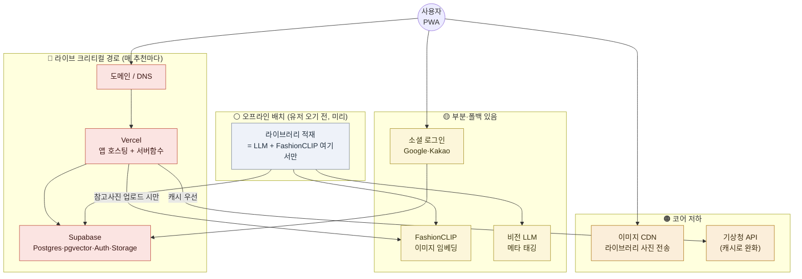

> ⚠️ **임베딩 모델 주의(현행 보정).** 이 문서의 **FashionCLIP은 잠정 후보**다 — '무드/분위기' 캡처는 **미검증**. 착수 전 바이크오프(`docs/additional_tech_review_v1.md` 스파이크①)로 확정하며 결과에 따라 embedding 정의가 바뀔 수 있다.

> 🔄 **2026-08-17 갱신:** 「참고 사진 올리기」 기능은 **폐기**됐다. 아래 본문에서 *참고사진*이 질의로 쓰인다고 적힌 부분은, 이제 **온보딩에서 유저가 고른 사진들**(PRD FR-1)로 읽으면 된다. 임베딩 + 벡터 유사도라는 방식 자체는 그대로다.

---

# rainism 외부 서비스 의존성 지도 v1

> 2026-07-09 · 분위기 매칭형 · 검증 단계 기준
> 스택: Next.js(PWA) · Vercel · Supabase(Postgres+pgvector+Auth+Storage) · 비전 LLM · FashionCLIP · 기상청 API

## 한눈 요약 — 3개 경로로 나눠 보기

의존성을 "장애가 나면 무슨 일이 벌어지나"로 묶으면 3층이다.

| 층 | 외부 서비스 | 장애 시 |
|---|---|---|
| 🔴 **라이브 크리티컬** (죽으면 앱이 안 됨) | **Vercel · Supabase · 도메인/DNS** | 앱 전면 마비 |
| 🟠 **코어 기능 저하** (앱은 뜨나 반쪽) | **이미지 CDN · 기상청** | 사진 안 보임 / 날씨 낡음(캐시로 완화) |
| 🟡 **부분·우아한 저하** (일부만, 폴백 있음) | **FashionCLIP · 비전 LLM · 소셜 로그인** | 참고사진 경로만·라이브러리 성장만·특정 로그인만 |
| ⚪ **내부만** (사용자 무영향) | 애널리틱스·에러 모니터링·메일 | 우리 시야만 잃음 |

**⭐ 구조적 강점:** 가장 비싼 AI 둘(비전 LLM, FashionCLIP 라이브러리 적재)은 **유저가 오기 전 오프라인 배치**에서만 돈다. 실시간 아침 추천 경로엔 없다 → **AI가 죽어도 추천은 살아있다.**

---

## 의존성 지도

---

## 외부 서비스별 상세

### 🔴 라이브 크리티컬 (단일 장애점 SPOF)

**Vercel** — 앱 호스팅 + 서버함수(/api/recommend, /api/weather)
- **비용**: Hobby 무료(대역폭 100GB), 상업/팀은 Pro $20/월·인.
- **대체**: ✅ 가능 (Netlify, Cloudflare Pages, 자체 호스팅). Next.js 표준이라 이전 어렵지 않음.
- **장애 영향**: **전면**. 앱 자체가 안 뜸 + 모든 서버함수 정지 → 추천·날씨 다 멈춤.

**Supabase** — DB(Postgres) + 벡터검색(pgvector) + 인증 + 이미지 저장
- **비용**: Free(DB 500MB·Storage 1GB·MAU 5만), Pro $25/월. **pgvector는 무료 포함**.
- **대체**: ⚠️ 부분적. Postgres 자체는 이식성 높지만, Auth·Storage·pgvector가 한 묶음이라 통째 이전은 손이 큼(중간 lock-in).
- **장애 영향**: **거의 전면**. 로그인·추천·저장 전부 불가. (앱 껍데기는 떠도 속이 빔)

**도메인 / DNS** — 주소·이름 해석 (등록기관 + Cloudflare DNS 등)
- **비용**: 도메인 ~₩15,000~20,000/년. DNS 무료(Cloudflare).
- **대체**: ✅ 가능 (DNS 제공자 교체).
- **장애 영향**: **전면**. 주소를 못 찾아 앱 접속 자체 불가. *가장 자주 잊는 SPOF.*

### 🟠 코어 기능 저하

**이미지 CDN** — 라이브러리 코디 사진 빠르게 전송 (Cloudflare 또는 Supabase 내장 CDN)
- **비용**: Cloudflare 무료 티어 관대 / Supabase Storage에 CDN 포함(무료 티어 내).
- **대체**: ✅ 쉬움 (정적 이미지라 어느 CDN이든).
- **장애 영향**: **비주얼 붕괴**. 이 앱은 사진이 전부라, 이미지 안 뜨면 추천 카드가 텅 빔 = 사실상 못 씀. 단, 데이터·로직은 살아있어 복구 즉시 정상.

**기상청 단기예보 API** — 오늘 날씨 원천 (체감온도·강수)
- **비용**: **무료**(공공). 트래픽 한도 있음(개발계정 일정 호출/일).
- **대체**: ⚠️ 대안 있으나(OpenWeather 등) 한국 정확도는 기상청이 최상. 트리거가 날씨라 품질 중요.
- **장애 영향**: **완화됨**. `weather_cache` 덕에 캐시가 따뜻하면 마지막 예보로 계속 추천 가능. 완전 다운+캐시 stale이면 "날씨 최신화만" 늦어짐(추천 로직은 캐시값으로 계속 동작). → 캐시가 방파제.

### 🟡 부분·우아한 저하 (폴백 존재)

**FashionCLIP (이미지 임베딩)** — 사진→벡터 (라이브러리 적재 + 유저 참고사진)
- **어디서 실행**: 호스팅 추론(Replicate·HF Endpoints·Modal) 또는 경량 자체 컨테이너.
- **비용**: 장당 소액(대략 $0.0002~0.001). 라이브러리 적재 때 대량 1회 + 참고사진 시 소량.
- **대체**: ✅ 모델 교체 가능. **단, 교체 시 라이브러리 전체 재임베딩 필수**(임베딩 공간이 달라짐 — 데이터모델 개선안 #6).
- **장애 영향**: **부분**. ①라이브러리 적재는 오프라인이라 유저 무영향(성장만 멈춤). ②유저가 참고사진 올릴 때 다운 → 그 사진 경로만 실패, **취향 벡터로 폴백**해 추천은 계속. → 우아한 저하.

**비전 LLM (Gemini Flash / Claude Haiku)** — 라이브러리 사진 메타 태깅(분위기·색·격식·온도밴드)
- **비용**: 장당 ~$0.001~0.004, 사용량 과금. **라이브러리 적재 시 1회만**(실시간 아님).
- **대체**: ✅ 쉬움 (Gemini↔Claude↔다른 비전모델 교체).
- **장애 영향**: **거의 없음(유저 기준)**. 오프라인 태깅 전용이라 실시간 추천 무관. 다운되면 새 사진 태깅만 대기.

**소셜 로그인 (Google / Kakao)** — 간편 가입·로그인 (Supabase Auth 경유)
- **비용**: 무료. (Apple 로그인은 Apple 개발자 $99/년 필요 → **PWA 검증 단계엔 불필요**, 네이티브/앱스토어 갈 때.)
- **대체**: ✅ 이메일 로그인 폴백.
- **장애 영향**: **부분**. 특정 제공자만 실패 → 다른 제공자/이메일로 로그인 가능.

### ⚪ 내부만 (사용자 무영향)

**애널리틱스·에러 모니터링** (Vercel Analytics / PostHog / Sentry)
- **비용**: 무료 티어. **대체**: ✅. **장애 영향**: 유저 0. 우리가 지표·에러 시야만 잃음.

**트랜잭션 메일** (Supabase 기본 또는 Resend) — 가입 확인·비번 재설정
- **비용**: Supabase 기본 무료(제한적) / Resend 무료 3,000통·월. **대체**: ✅.
- **장애 영향**: 신규 가입·재설정 메일만 지연. 기존 유저 무영향.

---

## 검증 단계 월 비용 롤업 (예산 5만원 대비)

| 서비스 | 월 비용 |
|---|---|
| Vercel · Supabase · 기상청 · CDN · 메일 · 애널리틱스 | ₩0 (무료 티어) |
| 비전 LLM (라이브러리 적재, 대부분 1회성) | ₩0~수천 |
| FashionCLIP 임베딩 (적재 1회 + 참고사진 소량) | ₩0~수천 |
| 도메인 (연 ~2만원 → 월 환산) | ~₩1,700 |
| **합계** | **₩0~1만 안팎** |

예산 5만원 안에 크게 여유. 무료 티어를 벗어나는 건 사용자가 유의미하게 늘고 **검증 성공 후**의 문제.

---

## 결론 — 무엇을 지켜야 하나

- **진짜 SPOF는 3개뿐: Vercel · Supabase · DNS.** 여기에 상태 모니터링을 걸고, 이전 가능성(특히 Supabase lock-in)을 늘 의식.
- **AI 의존성은 이미 오프라인으로 격리돼 견고.** 실시간 추천은 AI 없이도 캐시+DB로 돈다.
- **캐시가 방파제.** `weather_cache`(기상청)와 CDN(이미지)이 외부 장애를 대부분 흡수.
- **교체 시 유일한 함정 = 임베딩 모델.** FashionCLIP을 바꾸면 라이브러리 전체 재임베딩 필요 → 초기에 모델 신중히 고정.
