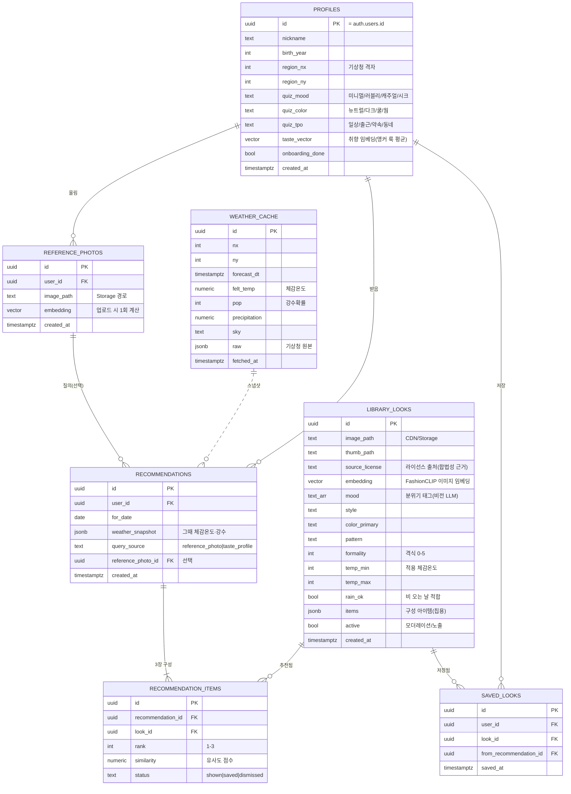
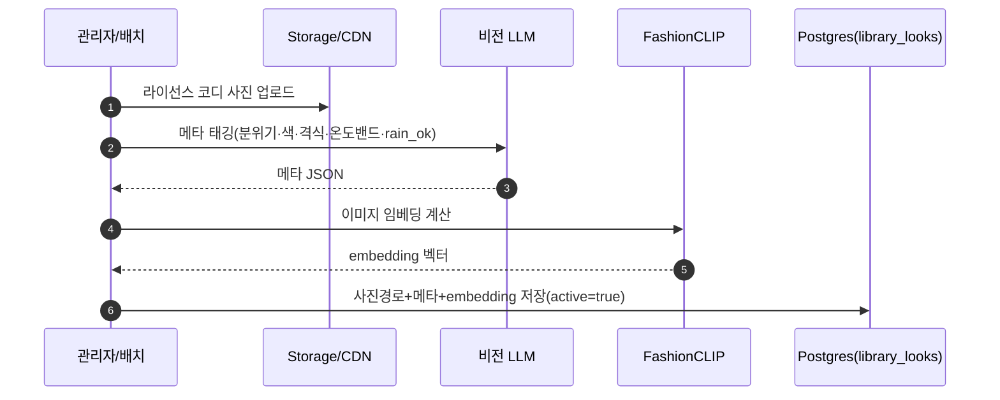
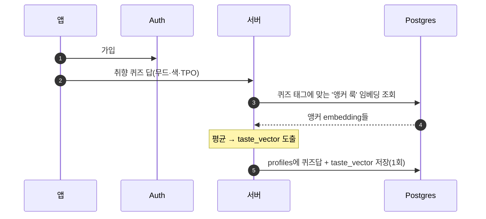
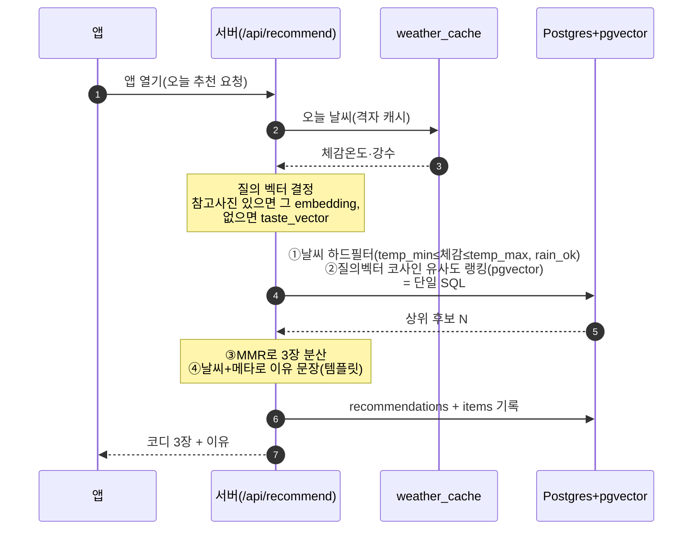
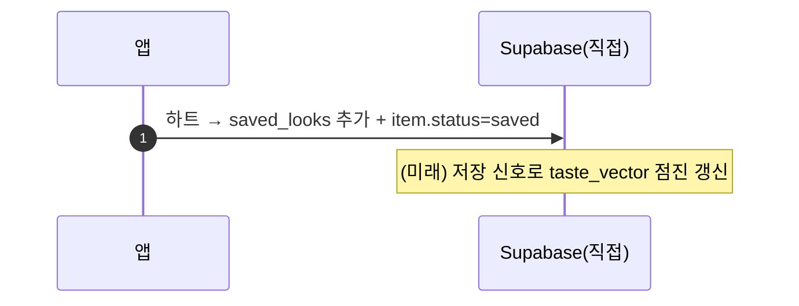

> ⚠️ **임베딩 모델 주의(현행 보정).** 이 문서의 **FashionCLIP은 잠정 후보**다 — '무드/분위기' 캡처는 **미검증**. 착수 전 바이크오프(`docs/추가기술검토_v1.md` 스파이크①)로 확정하며 결과에 따라 embedding 정의가 바뀔 수 있다.

---

# rainism 데이터 모델 v2 — 분위기 매칭형

> 2026-07-09 확정 · 이전 `데이터모델.md`(옷 조합형)를 **대체**함
> 저장 스택: **Supabase** — Postgres + **pgvector(임베딩 벡터 검색)** · Storage/CDN(이미지) · Auth(계정) · RLS(권한)

## 무엇이 근본적으로 바뀌었나

| | 옷 조합형(구) | 분위기 매칭형(신) |
|---|---|---|
| 코어 데이터 | 내 옷(`garments`) 조합 | **큐레이션 사진 라이브러리**에서 검색 |
| AI | 옷 태깅 + 조합 스코어 | **이미지 임베딩 + 벡터 유사도** |
| 핵심 신기술 | — | **pgvector**(Supabase 확장만 켜면 됨, 인프라 추가 0) |
| 저장 대상 | 내 옷 사진 | 내 **취향 벡터** + (선택)참고 사진 + 저장한 룩 |

---

## 데이터 영역 (4개)

| 영역 | 무엇 | 테이블 |
|---|---|---|
| 👤 **사용자·취향** | 누가·어떤 취향 | `profiles` · `reference_photos` |
| 🖼️ **큐레이션 라이브러리(코어 자산)** | 보여줄 코디 사진 풀 | `library_looks` |
| ✨ **추천·저장** | 오늘 보여준 것·저장한 것 | `recommendations` · `recommendation_items` · `saved_looks` |
| 🌧️ **날씨** | 오늘의 숫자 | `weather_cache` |
| 📚 참조·설정 | 앱 전역 규칙 | `coordi_rules`(날씨 하드필터) · `taxonomy`(태깅 어휘) |

**저장 형태 4종:** Postgres 행(구조화) · **pgvector 컬럼**(임베딩) · Storage/CDN(이미지 파일) · jsonb(날씨 스냅샷·룩 구성 아이템).

---

## 관계도 (ERD)

---

## 데이터 흐름 — 어떤 경로로 이동·처리되나

### 흐름 1. 라이브러리 적재 (우리 쪽, 오프라인·미리) 🖼️
> 유저와 무관하게 **미리** 채워두는 자산 구축 단계.

### 흐름 2. 온보딩 — 취향을 벡터로 👤

### 흐름 3. 아침 추천 — 코어 루프 ✨ (가장 중요)

### 흐름 4. 저장·피드백 💾

> **아키텍처 두-갈래 원칙 유지**: 추천(질의벡터 선택·MMR·로깅)은 **서버(/api/recommend)** 경유, 저장·내 저장룩 조회는 **Supabase 직접**. 기존 아키텍처와 정합.

---

## 비효율·아키텍처 불일치 → 개선안

| # | 문제(비효율/불일치) | 왜 문제인가 | 개선안 |
|---|---|---|---|
| 1 | 참고사진·취향 임베딩을 **매 요청 재계산** | 느리고 비쌈 | 업로드/온보딩 때 **1회 계산해 컬럼 저장**(`reference_photos.embedding`, `profiles.taste_vector`) |
| 2 | 라이브러리 **전체 로드 후 앱에서** 필터·유사도 | 확장 불가 + "무거운 로직은 서버" 아키텍처 위반 | **pgvector ANN 인덱스 + 메타 사전필터**를 서버에서 **단일 SQL**로 |
| 3 | 유저마다 **날씨 하드필터 반복** | 같은 격자·같은 날이면 후보풀이 동일한데 매번 재계산 | 격자별 **'오늘 입을 수 있는 후보풀' 1회 materialize** → 유저별론 벡터 랭킹만 |
| 4 | 라이브러리 이미지를 **매 추천마다 Storage에서 직접** | 정적·공유 이미지인데 egress 비용 폭증 | **CDN + 썸네일**. 공유 자산이라 캐시율 최고(비용 급감) |
| 5 | 추천 이유를 **요청마다 LLM** 생성 | 비용·지연 | 날씨+메타 태그로 **템플릿 문장**(결정론·무료). LLM은 흐름1 적재 때 **1회만** |
| 6 | 참고사진/라이브러리/취향 **임베딩 공간 불일치** 위험 | 다른 모델로 뽑으면 유사도 자체가 무의미 | 셋 다 **동일 모델(FashionCLIP)**로 임베딩 강제 |
| 7 | pgvector가 **기존 스택에 없었음** | 아키텍처 갱신 필요 | Supabase **확장만 켜면 됨**(인프라 추가 0). 벡터 검색은 서버 경유로 두-갈래 원칙 유지 |
| 8 | `taste_vector`가 **퀴즈=약한 prior** | 시간이 지나도 안 똑똑해짐 | 저장(하트)·dismiss 신호로 **점진 갱신**(흐름4, MVP 이후) |
| 9 | 라이브러리 **규모·다양성 부족** 시 반복 추천 | (모델 버그 아니라 **데이터 리스크**) | 날씨밴드별 **최소 벌수** 확보 — 큐레이션 라이브러리 소싱 계획과 직결 |

### 가장 큰 세 가지 (요약)
- **③ 격자별 후보풀 캐시** — 검증 넘어 사용자 늘 때 서버 비용을 가장 크게 좌우.
- **④ 이미지 CDN** — 라이브러리 이미지는 전 유저 공유 정적 자산 → CDN이 거의 공짜로 만들어 줌.
- **⑤ 이유는 LLM 말고 템플릿** — "랜덤 아님"은 날씨 하드필터+유사도에서 이미 나옴. 이유 문장에 LLM 쓸 이유 없음.
